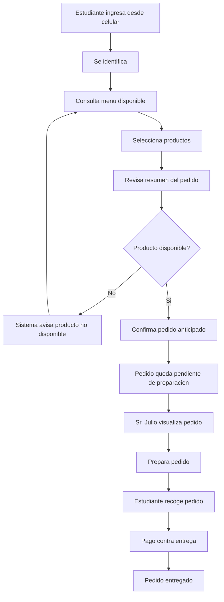

# 06. Diagrama de flujo - Pedir y recoger

Este diagrama representa el flujo principal de la primera iteracion XP para el caso **IngenioSnack**.

## Flujo principal

## Relacion con historias de usuario

| Paso del flujo | Historia relacionada |
|---|---|
| Identificacion del estudiante | HU-01 |
| Consulta de menu | HU-02 |
| Seleccion y confirmacion de pedido | HU-03 |
| Validacion de disponibilidad | HU-04 |
| Gestion del menu disponible | HU-05 |
| Pago contra entrega | HU-06 |

## Justificacion XP

El flujo se mantiene simple porque responde directamente al problema principal del cliente: reducir filas durante el recreo. No se agregan pasos de pago digital, delivery, inventario avanzado ni analitica compleja en esta primera iteracion.
