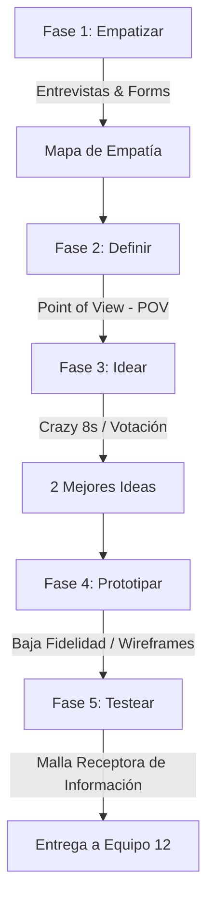

# Guía del Entregable: Semana 11 — Design Thinking
**Equipo de Innovación (Equipo 1 - Semana 11)**

Este documento es la guía metodológica y registro de evidencias para cumplir con el proceso de **Design Thinking** aplicado a la validación de nuevas ideas de negocio para **IngenioSnack**.

---

## 📌 Diagrama de Flujo del Proceso (Design Thinking)

---

## 👥 Guía del Trabajo en Equipo (Equipo 1)
El **Equipo 1** es el responsable de empatizar directamente con el usuario (estudiantes de la UNCP) para entender sus verdaderos puntos de dolor con respecto a la alimentación en la facultad. Su misión final es entregar una solución prototipada y testeada.

---

## 🎯 Fase 1: EMPATIZAR (Investigación del Estudiante UNCP)

### 📋 Estructura y Guion de la Entrevista (Microsoft Forms o Persona a Persona)
*El equipo deberá aplicar estas preguntas a un mínimo de 3 estudiantes de la UNCP.*

1. **Introducción:** *"Hola, somos del equipo de IngenioSnack. Queremos conocer cómo manejas tus desayunos y snacks durante tus clases y exámenes en la UNCP para hacer tu experiencia más rápida. ¿Nos regalas 5 minutos?"*
2. **Preguntas de Descubrimiento:**
   * ¿A qué hora sueles tomar desayuno o comer snacks dentro de la facultad?
   * ¿Cuál es tu mayor frustración al comprar comida entre clases (ej: filas, falta de stock)?
   * Si existiera una suscripción semanal que tuviera listo tu desayuno favorito (café y sándwich) a la hora que marcas, ¿cómo te ayudaría?
   * En épocas de exámenes parciales, ¿qué tipo de snacks buscas y cuánto tiempo tienes para comerlos?

### 🗺️ Mapa de Empatía Consolidado
*Rellena esta tabla según las respuestas recopiladas en las entrevistas.*

| ¿Qué DICEN los estudiantes? | ¿Qué PIENSAN los estudiantes? |
| :--- | :--- |
| • "Pierdo hasta 15 minutos en la fila y llego tarde a clase." • "Ojalá pudiera pagar por adelantado y solo recoger." | • "La comida rápida a veces no es saludable." • "Es estresante no saber si habrá stock de mi sándwich favorito." |
| **¿Qué HACEN los estudiantes?** | **¿Qué SIENTEN los estudiantes?** |
| • Compran galletas rápidas para evitar la cola larga. • Salen corriendo en los 10 minutos de break. | • Frustración por perder tiempo de estudio o descanso. • Ansiedad en parciales por falta de snacks energéticos. |

---

## 🎯 Fase 2: DEFINIR (Punto de Vista — POV)

A partir de la empatía, definimos el problema central:

> **Point of View (POV):**  
> **El estudiante de la UNCP** *necesita* **una forma automatizada de recibir su desayuno favorito listo para llevar sin hacer filas** *porque* **dispone de muy poco tiempo entre clases y siente frustración al comer mal o llegar tarde a sus aulas.**

---

## 🎯 Fase 3: IDEAR (Lluvia de Soluciones)

### 💡 Lluvia de Ideas (Crazy 8s / SCAMPER)
1. **Idea 1:** Suscripción mensual de desayuno con cobro programado.
2. **Idea 2:** Máquina expendedora inteligente recargable desde IngenioSnack.
3. **Idea 3:** Combo de suscripción "Café + Sándwich" semanal listo en casilleros térmicos.
4. **Idea 4:** "Caja Sorpresa de Exámenes" con frutos secos, barritas energéticas y bebidas hidratantes.
5. **Idea 5:** Delivery estudiantil en aulas mediante estudiantes que ganan puntos.
6. **Idea 6:** Pedidos grupales con descuento por aula.
7. **Idea 7:** Alerta de stock en tiempo real mediante notificaciones push en WhatsApp.
8. **Idea 8:** Tarjeta NFC para recojo express en caja prioritaria.
9. **Idea 9:** Reserva de mesa en la cafetería con comida ya servida.
10. **Idea 10:** Suscripción de snacks saludables diarios para profesores y administrativos.

### 🏆 Selección de las 2 Mejores Ideas (Votadas por el Equipo)
1. **Idea Ganadora 1 (Suscripción Semanal):** Suscripción pre-pagada de desayuno diario (Café + Sándwich favorito del estudiante) listo a una hora preestablecida.
2. **Idea Ganadora 2 (Caja Sorpresa Parciales):** Combo rápido en época de exámenes parciales ("Caja Sorpresa de Exámenes") con snacks energéticos.

---

## 🎯 Fase 4: PROTOTIPAR (Prototipo de Baja Fidelidad)

*Para la entrega en GitHub, el equipo debe guardar el boceto o wireframe en la ruta `docs/S11_Design_Thinking/PROTOTIPO.png`.*

### ✏️ Descripción del Prototipo Diseñado
Diseñamos un wireframe de baja fidelidad que consta de tres pantallas móviles simples:
1. **Pantalla 1 (Suscripción):** Un banner llamativo que dice *"Suscríbete a tus Mañanas"* donde el estudiante selecciona los días de la semana y la hora exacta de recogida.
2. **Pantalla 2 (Exámenes Parciales):** Pestaña especial *"Caja Sorpresa de Exámenes"* para comprar un pack de snacks pre-armado de alta energía con un solo clic.
3. **Pantalla 3 (Fidelidad Dorada):** Vista de la tarjeta de fidelidad del estudiante que brilla en color dorado al llenarse.

---

## 🎯 Fase 5: TESTEAR (Validación de Prototipo)

### 📊 Malla Receptora de Información (Feedback de Usuarios)
*Presentamos el prototipo a 2 estudiantes y recopilamos su feedback:*

| 🟢 Cosas Interesantes / Gustos | 🔴 Críticas Constructivas / No Gustó |
| :--- | :--- |
| • "Me encanta la idea de no hacer cola en la mañana." • "La tarjeta de fidelidad dorada se ve muy interactiva." | • "La suscripción mensual es muy cara para pagarla de golpe, preferiría semanal." • "La hora de recogida debería poder cambiarse hasta 30 minutos antes." |
| **❓ Preguntas / Dudas del Usuario** | **💡 Nuevas Ideas que surgieron** |
| • ¿Qué pasa si mi clase se cancela y no recojo el pedido? • ¿Puedo pagar la suscripción con Yape/Plin? | • Crear suscripciones grupales para compartir con amigos de carpeta. • Añadir un temporizador de cuenta regresiva en el recojo. |
