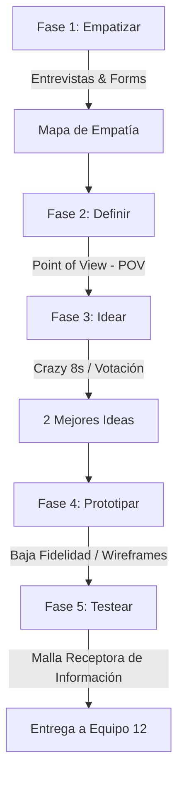

# Guía del Entregable: Semana 11 — Design Thinking
**Equipo de Innovación (Equipo 1 - Semana 11)**

Este documento es la guía metodológica y registro de evidencias para cumplir con el proceso de **Design Thinking** aplicado a la validación de nuevas ideas de negocio para **IngenioSnack**.

---

## 📌 Diagrama de Flujo del Proceso (Design Thinking)



---

## 👥 Guía del Trabajo en Equipo (Equipo 1)
El **Equipo 1** es el responsable de empatizar directamente con el usuario (estudiantes de la UNCP) para entender sus verdaderos puntos de dolor con respecto a la alimentación en la facultad. Su misión final es entregar una solución prototipada y testeada.

---

## 🎯 Fase 1: EMPATIZAR (Investigación del Estudiante UNCP)

### 📋 Estructura y Guion de la Entrevista (Microsoft Forms o Persona a Persona)
*El equipo deberá aplicar estas preguntas a un mínimo de 3 estudiantes de la UNCP.*

1. **Introducción:** *"Hola, somos del equipo de IngenioSnack. Queremos conocer cómo manejas tus desayunos y snacks durante tus clases y exámenes en la UNCP para hacer tu experiencia más rápida. ¿Nos regalas 5 minutos?"*
2. **Preguntas de Descubrimiento:**
   * ¿A qué hora sueles tomar desayuno o comer snacks dentro de la facultad?
   * ¿Cuál es tu mayor frustración al comprar comida entre clases (ej: filas, falta de stock)?
   * Si existiera una suscripción semanal que tuviera listo tu desayuno favorito (café y sándwich) a la hora que marcas, ¿cómo te ayudaría?
   * En épocas de exámenes parciales, ¿qué tipo de snacks buscas y cuánto tiempo tienes para comerlos?

### 🗺️ Mapa de Empatía Consolidado
*Rellena esta tabla según las respuestas recopiladas en las entrevistas.*

| ¿Qué DICEN los estudiantes? | ¿Qué PIENSAN los estudiantes? |
| :--- | :--- |
| • "Pierdo hasta 15 minutos en la fila y llego tarde a clase."<br>• "Ojalá pudiera pagar por adelantado y solo recoger." | • "La comida rápida a veces no es saludable."<br>• "Es estresante no saber si habrá stock de mi sándwich favorito." |
| **¿Qué HACEN los estudiantes?** | **¿Qué SIENTEN los estudiantes?** |
| • Compran galletas rápidas para evitar la cola larga.<br>• Salen corriendo en los 10 minutos de break. | • Frustración por perder tiempo de estudio o descanso.<br>• Ansiedad en parciales por falta de snacks energéticos. |

---

## 🎯 Fase 2: DEFINIR (Punto de Vista — POV)

A partir de la empatía, definimos el problema central:

> **Point of View (POV):**  
> **El estudiante de la UNCP** *necesita* **una forma automatizada de recibir su desayuno favorito listo para llevar sin hacer filas** *porque* **dispone de muy poco tiempo entre clases y siente frustración al comer mal o llegar tarde a sus aulas.**

---

## 🎯 Fase 3: IDEAR (Lluvia de Soluciones)

### 💡 Lluvia de Ideas (Crazy 8s / SCAMPER)
1. **Idea 1:** Suscripción mensual de desayuno con cobro programado.
2. **Idea 2:** Máquina expendedora inteligente recargable desde IngenioSnack.
3. **Idea 3:** Combo de suscripción "Café + Sándwich" semanal listo en casilleros térmicos.
4. **Idea 4:** "Caja Sorpresa de Exámenes" con frutos secos, barritas energéticas y bebidas hidratantes.
5. **Idea 5:** Delivery estudiantil en aulas mediante estudiantes que ganan puntos.
6. **Idea 6:** Pedidos grupales con descuento por aula.
7. **Idea 7:** Alerta de stock en tiempo real mediante notificaciones push en WhatsApp.
8. **Idea 8:** Tarjeta NFC para recojo express en caja prioritaria.
9. **Idea 9:** Reserva de mesa en la cafetería con comida ya servida.
10. **Idea 10:** Suscripción de snacks saludables diarios para profesores y administrativos.

### 🏆 Selección de las 2 Mejores Ideas (Votadas por el Equipo)
1. **Idea Ganadora 1 (Suscripción Semanal):** Suscripción pre-pagada de desayuno diario (Café + Sándwich favorito del estudiante) listo a una hora preestablecida.
2. **Idea Ganadora 2 (Caja Sorpresa Parciales):** Combo rápido en época de exámenes parciales ("Caja Sorpresa de Exámenes") con snacks energéticos.

---

## 🎯 Fase 4: PROTOTIPAR (Prototipo de Alta Fidelidad & Figma)

*Para la entrega en GitHub, el equipo debe guardar el boceto o wireframe en la ruta `docs/S11_Design_Thinking/PROTOTIPO.png`.*

### ✏️ Contexto del Sistema e Identidad Visual
**IngenioSnack** es una plataforma móvil/web progresiva (PWA) de alto impacto diseñada específicamente para la comunidad universitaria de la Universidad Nacional del Centro del Perú (UNCP). El ecosistema resuelve el problema del escaso tiempo que tienen los estudiantes en sus recesos (breaks de 10-15 minutos) conectando de forma directa a la cafetería/vendedor con el estudiante. Permite a los usuarios pre-pagar, programar y retirar desayunos, almuerzos, combos especiales y snacks saludables mediante un flujo rápido sin filas, integrando un sistema inteligente de fidelización gamificado.

La identidad visual del prototipo se basa en un diseño premium, limpio y de estética minimalista moderna, pensado para destacar visualmente en Figma:
*   **Color Primario (Índigo Tecnológico - `#4F46E5`):** Utilizado para estructurar la aplicación. Representa la digitalización, la confianza y la eficiencia operativa. Presente en headers, botones primarios y estados activos.
*   **Color Secundario / Acento (Ámbar Energético - `#F59E0B`):** Relacionado con la comida apetitosa, la energía y las recompensas. Se aplica a estrellas, estados de alerta positiva, ofertas exclusivas y elementos de gamificación.
*   **Gradiente de Fidelidad (Oro Metálico - `#F59E0B` a `#D97706`):** Un gradiente cálido en diagonal de 135 grados que simula una tarjeta dorada brillante para denotar estatus premium de fidelización activa.
*   **Fondo Limpio (Slate Soft - `#F8FAFC`):** Fondo ultra claro que reduce el ruido visual, ideal para resaltar las tarjetas de comida y los botones de acción rápida.
*   **Texto y Contraste (Slate Deep - `#0F172A` para títulos, `#64748B` para descripciones muted):** Garantiza legibilidad óptima y accesibilidad (WCAG AA).

---

### 📱 Descripción Detallada del Prototipo (Wireframes de Flujo)
Diseñamos un flujo móvil interactivo en Figma de tres pantallas:
1.  **Pantalla 1 — Suscripción Mañanera Express:**
    *   **Layout:** Barra de navegación superior minimalista con el logotipo de IngenioSnack a la izquierda (techo de tienda en color ámbar/índigo) y la foto de perfil del estudiante a la derecha.
    *   **Cuerpo:** Un banner superior curvo de color índigo profundo (`#4F46E5`) con bordes redondeados (16px) que dice *"Programa tus Mañanas y Evita Colas"*. Debajo, un selector interactivo horizontal con los días de la semana (Lunes a Viernes) en formato de píldoras. El día seleccionado destaca en fondo índigo y texto blanco. Incluye un input circular interactivo de selección de hora (estilo reloj inteligente) preconfigurado a las `07:45 AM`.
    *   **Acción:** Un gran botón de llamada a la acción en la parte inferior en color Índigo con sombra paralela difuminada que dice *"Confirmar Suscripción Semanal (S/ 15.00)"*.
2.  **Pantalla 2 — Caja Sorpresa de Exámenes (Parciales):**
    *   **Layout:** Fondo slate suave. Una tarjeta grande central (Card) con bordes de 16px, fondo blanco y una ilustración en vectores minimalista 3D de una "Caja de Regalo Energética" en gradiente naranja a amarillo.
    *   **Cuerpo:** Título en negrita *"Caja Sorpresa Parciales"*, acompañado de una lista de viñetas limpia con iconos de check: *Bebida hidratante, Frutos secos seleccionados, Barra de cereal alta en proteínas*. El precio se presenta de forma atractiva: un badge con el precio real tachado y al costado, en color Ámbar y fuente más grande, la oferta especial: *"S/ 3.00 + 50 Puntos de Regalo"*.
    *   **Acción:** Botón activo de compra con un solo toque: *"Comprar con Un Clic ⚡"*.
3.  **Pantalla 3 — Perfil y Tarjeta de Fidelidad Dorada:**
    *   **Layout:** Pantalla de perfil de usuario con cabecera limpia.
    *   **Cuerpo:** Una tarjeta que imita una tarjeta de crédito física con bordes de 20px. Su fondo es un gradiente dorado metálico pulido (`linear-gradient(135deg, #F59E0B, #D97706)`). Dentro de la tarjeta, se observa una cuadrícula interactiva de 10 círculos semitransparentes. 9 de ellos contienen una estrella brillante de color ámbar. El 10mo círculo tiene una micro-animación de destello indicando que el siguiente consumo desbloquea el premio.
    *   **Acción:** Un botón inferior destacado en color Slate Deep con texto blanco que dice *"Canjear Café de Especialidad Gratis ☕"*.

---

### 🎨 Prompt para Copiar y Pegar en Figma AI / Plugins de Generación (Figma prompt)

Aquí tienes dos versiones del prompt listas para copiar. La versión en inglés es la más recomendada para herramientas globales de Figma AI (como *Figma AI*, *Builder.io*, *Wireframe Designer*, *Galileo AI*, o *Uizard*), mientras que la versión en español está optimizada para traductores de prompts o plugins en español.

#### Opción A: Prompt en Inglés (Altamente Recomendado)
```text
Create a premium, modern, and minimalist mobile app UI for a college food prepay and scheduling application named "IngenioSnack".
Device frame: iPhone 14/15 Portrait.
Design System:
- Typography: Inter font family, bold titles, clean body text hierarchy.
- Color Palette: Primary Indigo (#4F46E5) for headers/main buttons; Accent Amber (#F59E0B) for ratings/gamification; Light Slate (#F8FAFC) for page background; Deep Slate (#0F172A) for dark text; Muted Gray (#64748B) for secondary text.
- UI elements: 16px rounded corners, subtle elevation/drop shadows, clear spacing, clean vector icons.

Generate a three-screen sequential flow:
1. Screen 1: "Subscription Screen". Has a minimalist header with a small store-roof logo and student profile avatar. The main section displays a curved Indigo card saying "Plan Your Week & Skip Lines". Below, horizontal day selectors (Mon-Fri) styled as interactive pills (Monday selected in active Indigo style). Underneath, a modern circular analog/digital time-picker showing "07:45 AM". Bottom sticky CTA button: "Subscribe Weekly (S/15.00)" in Indigo.
2. Screen 2: "Exams Surprise Box Screen". A product detail screen. Highlights a central card with a 3D-styled geometric gift box icon in orange-yellow gradient. Bold title "Exams Energy Box" with bullets: "Hydration drink, Mixed nuts, High-protein bar". Price tags show a crossed-out regular price next to a bright Amber badge displaying "S/ 3.00 + 50 Pts". Features a prominent "One-Tap Order ⚡" button.
3. Screen 3: "Loyalty Profile Screen". Displays a digital fidelity stamp card styled like a physical card using a metallic gold gradient background (#F59E0B to #D97706). It shows a grid of 10 circular stamp slots, with 9 slots filled with glowing Amber stars. Below this card, a bold action button says "Redeem Free Specialty Coffee ☕".
```

#### Opción B: Prompt en Español (Adaptado)
```text
Diseña una interfaz de usuario móvil premium, moderna y minimalista para una aplicación de prepago y programación de comida universitaria llamada "IngenioSnack".
Dispositivo: iPhone 14/15 Vertical.
Sistema de Diseño:
- Tipografía: Familia tipográfica Inter, títulos en negrita, jerarquía limpia.
- Paleta de Colores: Índigo Primario (#4F46E5) para botones y encabezados; Ámbar Secundario (#F59E0B) para estrellas y recompensas; Slate Claro (#F8FAFC) para el fondo; Slate Oscuro (#0F172A) para texto principal.
- Estética: Bordes redondeados de 16px, sombras suaves, espaciado generoso e iconos vectoriales limpios.

Genera un flujo secuencial de tres pantallas:
1. Pantalla 1: "Suscripción Semanal". Cabecera con logo minimalista y foto de perfil. Un banner curvo en color Índigo que dice "Programa tu Semana y Evita Colas". Selector horizontal de lunes a viernes en forma de píldoras. Un selector de hora circular digital que marca "07:45 AM". Botón de acción principal abajo: "Suscribirse Semanal (S/ 15.00)".
2. Pantalla 2: "Caja Sorpresa de Parciales". Detalle de producto destacando una tarjeta central con una ilustración minimalista de una caja de regalo en gradiente naranja a amarillo. Título "Caja Sorpresa Parciales", descripción breve de snacks saludables y precio tachado junto a la oferta en Ámbar "S/ 3.00 + 50 pts". Botón de compra rápida: "Comprar con 1-Clic ⚡".
3. Pantalla 3: "Tarjeta de Fidelidad Dorada". Sección de perfil que muestra una tarjeta digital con gradiente dorado metálico brillante (#F59E0B a #D97706). Contiene una grilla de 10 casilleros de sellos, con 9 casilleros completados con estrellas de color ámbar. Botón activo abajo: "Canjear Café Gratis ☕".
```

---

## 🎯 Fase 5: TESTEAR (Validación de Prototipo)

### 📊 Malla Receptora de Información (Feedback de Usuarios)
*Presentamos el prototipo a 2 estudiantes y recopilamos su feedback:*

| 🟢 Cosas Interesantes / Gustos | 🔴 Críticas Constructivas / No Gustó |
| :--- | :--- |
| • "Me encanta la idea de no hacer cola en la mañana."<br>• "La tarjeta de fidelidad dorada se ve muy interactiva." | • "La suscripción mensual es muy cara para pagarla de golpe, preferiría semanal."<br>• "La hora de recogida debería poder cambiarse hasta 30 minutos antes." |
| **❓ Preguntas / Dudas del Usuario** | **💡 Nuevas Ideas que surgieron** |
| • ¿Qué pasa si mi clase se cancela y no recojo el pedido?<br>• ¿Puedo pagar la suscripción con Yape/Plin? | • Crear suscripciones grupales para compartir con amigos de carpeta.<br>• Añadir un temporizador de cuenta regresiva en el recojo. |
