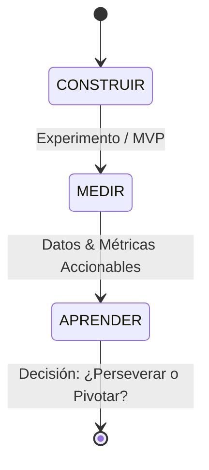

# Ciclo CMA (Construir, Medir, Aprender) y Simulación de Validación
**Equipo de Validación Ágil (Equipo 2 - Semana 12)**

Este documento resume la ejecución simulada del ciclo **Construir-Medir-Aprender** para validar el modelo de negocio de IngenioSnack.

---

## 🔄 El Ciclo Lean Startup

### 1. CONSTRUIR (¿Qué hicimos?)
Creamos la landing page del MVP de la suscripción y de las cajas sorpresa de exámenes. Distribuimos el enlace en los grupos de WhatsApp y salones de clase de la Facultad de Ingeniería de Sistemas (FIS) durante una semana.

### 2. MEDIR (¿Qué datos recopilamos?)
Establecemos la diferencia crítica de métricas para tomar decisiones profesionales:

* **Métrica Vanidosa (No sirve para decidir):** 
  * *Número de visitas a la landing page.* (Tuvimos 450 visitas, pero las visitas no pagan las cuentas).
* **Métrica Accionable (Mide interés real de compra):**
  * *Tasa de Conversión:* Porcentaje de visitas que hicieron clic en "Comprar Suscripción" e ingresaron sus datos de correo para el pre-registro.
  * *Criterio de éxito:* Si la conversión es **mayor al 15%**, se considera validado el interés de pago.

#### 📊 Resultados Simulados de la Medición:
* Visitas totales: 450 estudiantes.
* Clics en "Comprar Suscripción Semanal S/ 15": 82 estudiantes (**18.2% de conversión**).
* Clics en "Reservar Caja Sorpresa Exámenes S/ 5": 23 estudiantes (**5.1% de conversión**).

---

### 3. APRENDER: ¿Perseverar o Pivotar?

Analizando las métricas accionables:

* **Para la Suscripción Semanal de Desayunos:**
  * **Resultado:** La conversión (**18.2%**) superó con éxito el umbral mínimo del 15%. Los estudiantes demuestran un interés de pago real y alto por automatizar sus desayunos.
  * **Decisión:** **PERSEVERAR**. Se autoriza el inicio del desarrollo técnico de la suscripción en el software e inversión en los insumos.

* **Para la Caja Sorpresa de Exámenes:**
  * **Resultado:** La conversión (**5.1%**) estuvo muy por debajo del objetivo. Los estudiantes prefieren armar sus propios snacks y no pagar por una caja sorpresa en parciales.
  * **Decisión:** **PIVOTAR**. Detener la compra de insumos y cajas para esta idea. Modificar la idea para vender "combos de estudio" personalizados de alta energía directamente desde el carrito regular, en lugar de cajas sorpresa fijas.
