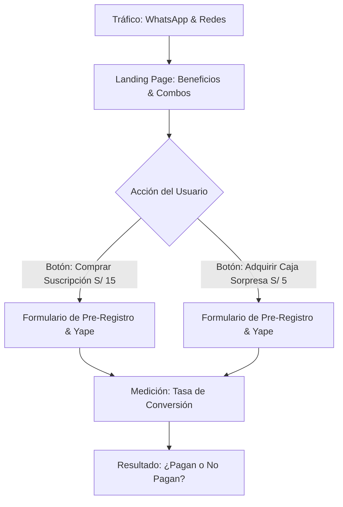

# Diseño del MVP (Producto Mínimo Viable)
**Equipo de Validación Ágil (Equipo 2 - Semana 12)**

Este documento detalla la formulación de hipótesis clave y el diseño del MVP para validar si los estudiantes de la UNCP están realmente dispuestos a pagar por el nuevo servicio de suscripción de IngenioSnack.

---

## 🎯 Formulación de Hipótesis de Negocio

Redactamos las 3 hipótesis clave en el formato metodológico establecido:

1. **Hipótesis 1 (Suscripción):**
   > *"Creemos que **los estudiantes de ciclos superiores de la FIS** tienen el problema de **perder tiempo desayunando entre clases** y estarían dispuestos a pagar **una suscripción semanal de S/ 15.00** para resolverlo."*
2. **Hipótesis 2 (Caja Sorpresa):**
   > *"Creemos que **los estudiantes universitarios en semanas de exámenes** tienen el problema de **falta de energía y concentración** y estarían dispuestos a pagar **S/ 5.00 por una 'Caja Sorpresa' de snacks energéticos** para resolverlo."*
3. **Hipótesis 3 (Fidelidad):**
   > *"Creemos que **los usuarios frecuentes de la cafetería** valoran los premios y estarían dispuestos a **recomendar el servicio a 2 amigos** para rellenar su **tarjeta de fidelidad dorada** más rápido."*

---

## 🚀 Diseño del Experimento MVP: "Smoke Test" (Prueba de Humo)

Para validar si las personas pagarían por el servicio antes de escribir código o comprar insumos, el MVP consistirá en una **Landing Page de Registro y Pre-venta Simulada**.

### 📋 Detalles del MVP
* **Landing Page:** Una página web simple (hecha en HTML/CSS plano o Canva) que muestra imágenes atractivas del desayuno diario listo y de la Caja Sorpresa de Exámenes.
* **El Botón de Acción (Call to Action - CTA):**
  * Botón 1: *"Comprar suscripción semanal (S/ 15.00)"*
  * Botón 2: *"Reservar mi Caja Sorpresa de Exámenes (S/ 5.00)"*
* **Mecanismo de Validación:** Al hacer clic en cualquiera de los botones, el sistema abre un breve formulario de registro que simula una cola de espera: *"Estamos preparando los pedidos para tu facultad. Regístrate con tu correo y sé de los primeros 30 en recibirlo gratis el lunes."*
* **Justificación del bajo costo:** No requiere base de datos compleja, pasarela de pago real, ni logística. Se implementa en un par de horas a costo cero.
